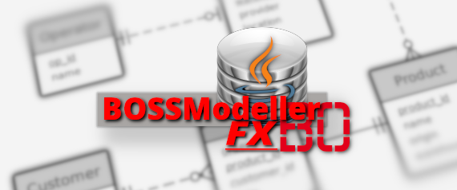

# BOSSModellerFX

## BO's Simple SQL Modeller
BOSSModellerFX is a free redesign of the original BOSSModeler project. BOSSModeler was created as part of a software project at Bochum University of Applied Science.

This softare allows you to manage and design professional ER models in the crow's-foot-notation.

### Features
* Edits complex data models in crows-foot-notation
* Multi-Tabs, multiple projects can be edited the same time.
* Converts ERM into logical model.
* Generates SQL scripts for supported DBMS.
* Imports data model from external database
* Exports project to supported database
* User can leave comments on project.
* Project display can be exported to a picture.
* Can support multiple languages.

### Supported DBMS
1. PostgreSQL
2. MySQL
3. MSSQL
